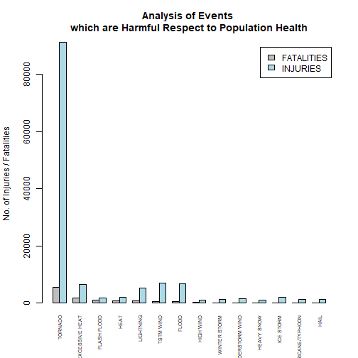
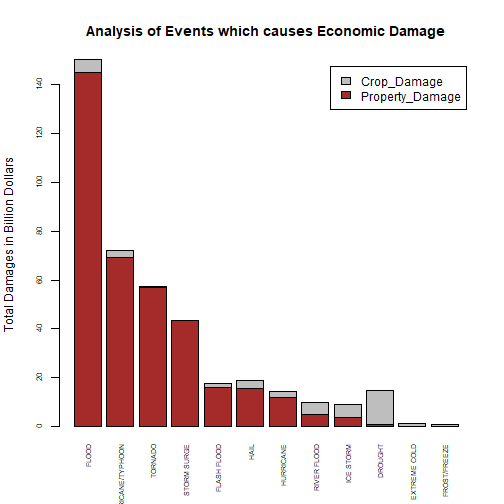

## Synopsis

Storms and other weather conditions severe affect the population health as well as the economic conditions. This can results in severe Fatalities, Injuries and Property Damages which becomes very important to control these events. 

An analysis has been done on U.S. National Oceanic and Atmospheric Administration's (NOAA). The database is from 1950 to Nov 2011. In this analysis we will identify which weather events are severe to population health and economic condition across U.S.

We have used barplot to plot the data and identified that **Tornado** affects the population health majorly and **Flood** causes major Economic Damage across U.S.

## Data Loading and Processing

```r
## Loading required packages
library(dplyr)

## Changing the size of digits
options(scipen = 999,digits = 10)
```


```r
## Loading the data in R

weather_data = read.csv("C:\\Users\\Abhinav Khandelwal\\Desktop\\R_project\\R_Learning_Coursera\\StormData.csv")

head(weather_data,2)
```

```
##   STATE__          BGN_DATE BGN_TIME TIME_ZONE COUNTY COUNTYNAME STATE  EVTYPE BGN_RANGE
## 1       1 4/18/1950 0:00:00     0130       CST     97     MOBILE    AL TORNADO         0
## 2       1 4/18/1950 0:00:00     0145       CST      3    BALDWIN    AL TORNADO         0
##   BGN_AZI BGN_LOCATI END_DATE END_TIME COUNTY_END COUNTYENDN END_RANGE END_AZI END_LOCATI
## 1                                               0         NA         0                   
## 2                                               0         NA         0                   
##   LENGTH WIDTH F MAG FATALITIES INJURIES PROPDMG PROPDMGEXP CROPDMG CROPDMGEXP WFO STATEOFFIC
## 1     14   100 3   0          0       15    25.0          K       0                          
## 2      2   150 2   0          0        0     2.5          K       0                          
##   ZONENAMES LATITUDE LONGITUDE LATITUDE_E LONGITUDE_ REMARKS REFNUM
## 1               3040      8812       3051       8806              1
## 2               3042      8755          0          0              2
```

For the analysis i need only few columns like "EVTYPE","FATALITIES","INJURIES","PROPDMG","
PROPDMGEXP","CROPDMG","CROPDMGEXP". I will use Select function to extract these columns.


```r
weather_data_cleaned = select(weather_data,"EVTYPE","FATALITIES","INJURIES",contains("DMG"))
## Making all the EVTYPE's in upper case

weather_data_cleaned$EVTYPE = toupper(weather_data_cleaned$EVTYPE)
head(weather_data_cleaned,2)
```

```
##    EVTYPE FATALITIES INJURIES PROPDMG PROPDMGEXP CROPDMG CROPDMGEXP
## 1 TORNADO          0       15    25.0          K       0           
## 2 TORNADO          0        0     2.5          K       0
```

In the dataset the EVTYPE is in character datatype need to change into factor for the analysis


```r
weather_data_cleaned$EVTYPE = as.factor(weather_data_cleaned$EVTYPE)
str(weather_data_cleaned)
```

```
## 'data.frame':	902297 obs. of  7 variables:
##  $ EVTYPE    : Factor w/ 898 levels "   HIGH SURF ADVISORY",..: 758 758 758 758 758 758 758 758 758 758 ...
##  $ FATALITIES: num  0 0 0 0 0 0 0 0 1 0 ...
##  $ INJURIES  : num  15 0 2 2 2 6 1 0 14 0 ...
##  $ PROPDMG   : num  25 2.5 25 2.5 2.5 2.5 2.5 2.5 25 25 ...
##  $ PROPDMGEXP: chr  "K" "K" "K" "K" ...
##  $ CROPDMG   : num  0 0 0 0 0 0 0 0 0 0 ...
##  $ CROPDMGEXP: chr  "" "" "" "" ...
```

As we can see from above that we have 985 EVTYPE. From the str summary you can see that there are 0's at many places which is not required in our analysis. So we will keep only those rows which will have values.And for the analysis i need to divide the dataset into 2 parts first is related to Population Health and second related to Economic Consequences.


```r
popdata = weather_data_cleaned %>% select(1,2,3) %>% filter(FATALITIES > 0 | INJURIES > 0)
head(popdata)
```

```
##    EVTYPE FATALITIES INJURIES
## 1 TORNADO          0       15
## 2 TORNADO          0        2
## 3 TORNADO          0        2
## 4 TORNADO          0        2
## 5 TORNADO          0        6
## 6 TORNADO          0        1
```

```r
econodata = weather_data_cleaned %>% select(1,contains("DMG")) %>% filter(PROPDMG >0 | CROPDMG > 0)
head(econodata)
```

```
##    EVTYPE PROPDMG PROPDMGEXP CROPDMG CROPDMGEXP
## 1 TORNADO    25.0          K       0           
## 2 TORNADO     2.5          K       0           
## 3 TORNADO    25.0          K       0           
## 4 TORNADO     2.5          K       0           
## 5 TORNADO     2.5          K       0           
## 6 TORNADO     2.5          K       0
```

Let's see the econodata what all EXP we have in PROP and CROP.

```r
unique(econodata$PROPDMGEXP)
```

```
##  [1] "K" "M" "B" "m" ""  "+" "0" "5" "6" "4" "h" "2" "7" "3" "H" "-"
```

```r
unique(econodata$CROPDMGEXP)
```

```
## [1] ""  "M" "K" "m" "B" "?" "0" "k"
```
From above, it is quite visible that there are some EXP which are not valid. Valid values are K for kilos, M for millions ,B for billions. 

Replacing all EXP which are invalid to 0 and keeping the valid one's.

```r
econodata = econodata %>% mutate(CROPDMGEXP =  case_when(CROPDMGEXP %in% c("K","m","M","B")~CROPDMGEXP,TRUE ~ "0"))

econodata = econodata %>% mutate(PROPDMGEXP =  case_when(PROPDMGEXP %in% c("K","k","b","m","M","B")~PROPDMGEXP,TRUE ~ "0"))
```

Now we will substitute the actual values of EXP in the Econodata.


```r
econodata = econodata %>% mutate(PROPEXP = case_when(PROPDMGEXP == "K" ~ PROPDMG * 1000,PROPDMGEXP == "k" ~ PROPDMG * 1000,PROPDMGEXP == "m" ~ PROPDMG * 1000000,PROPDMGEXP == "M" ~ PROPDMG * 1000000,PROPDMGEXP == "B" ~ PROPDMG * 1000000000,PROPDMGEXP == "b" ~ PROPDMG * 1000000000, TRUE ~ PROPDMG))

head(arrange(econodata,desc(PROPEXP),10))
```

```
##              EVTYPE PROPDMG PROPDMGEXP CROPDMG CROPDMGEXP      PROPEXP
## 1             FLOOD  115.00          B    32.5          M 115000000000
## 2       STORM SURGE   31.30          B     0.0          0  31300000000
## 3 HURRICANE/TYPHOON   16.93          B     0.0          0  16930000000
## 4       STORM SURGE   11.26          B     0.0          0  11260000000
## 5 HURRICANE/TYPHOON   10.00          B     0.0          0  10000000000
## 6 HURRICANE/TYPHOON    7.35          B     0.0          0   7350000000
```

```r
econodata = econodata %>% mutate(CROPEXP = case_when(CROPDMGEXP == "K" ~ CROPDMG * 1000,CROPDMGEXP == "k" ~ CROPDMG * 1000,CROPDMGEXP == "m" ~ CROPDMG * 1000000,CROPDMGEXP == "M" ~ CROPDMG * 1000000,CROPDMGEXP == "B" ~ CROPDMG * 1000000000,CROPDMGEXP == "b" ~ CROPDMG * 1000000000, TRUE ~ CROPDMG))

head(arrange(econodata,desc(CROPEXP),10))
```

```
##              EVTYPE PROPDMG PROPDMGEXP CROPDMG CROPDMGEXP    PROPEXP    CROPEXP
## 1       RIVER FLOOD    5.00          B    5.00          B 5000000000 5000000000
## 2         ICE STORM  500.00          K    5.00          B     500000 5000000000
## 3 HURRICANE/TYPHOON    5.88          B    1.51          B 5880000000 1510000000
## 4           DROUGHT    0.00          0    1.00          B          0 1000000000
## 5      EXTREME COLD    0.00          0  596.00          M          0  596000000
## 6           DROUGHT    0.00          0  578.85          M          0  578850000
```

Now the cleaning part is done. We will now plot the datasets to answer the questions.

## Results

#### **Across the United States, which types of events (as indicated in the EVTYPE variable) are most harmful with respect to population health?**

Aggregating the Fatalities and Injuries across the EVTYPES and we will keep only those rows where the value of FATALITIES and INJURIES arae more than 1000 otherwise our plot will be messy.


```r
popdata_total = popdata%>% group_by(EVTYPE) %>% summarise(sum(FATALITIES),sum(INJURIES)) %>% rename(FATALITIES = "sum(FATALITIES)",INJURIES = "sum(INJURIES)") %>% filter(FATALITIES > 1000 | INJURIES > 1000)%>% arrange(desc(FATALITIES),desc(INJURIES)) %>%as.data.frame()

head(popdata_total)
```

```
##           EVTYPE FATALITIES INJURIES
## 1        TORNADO       5633    91346
## 2 EXCESSIVE HEAT       1903     6525
## 3    FLASH FLOOD        978     1777
## 4           HEAT        937     2100
## 5      LIGHTNING        816     5230
## 6      TSTM WIND        504     6957
```

**Plotting the graph which shows which EVTYPES are more harmful to population health**

We will now plot popdata_total to see which weather event is more harmful to population health.


```r
barplot(as.matrix(t(popdata_total[,-1])),beside = TRUE,names.arg = popdata_total$EVTYPE,legend.text = c("FATALITIES","INJURIES"),col = c("grey","lightblue"),ylab = "No. of Injuries / Fatalities",las = 3,cex.axis = 01,cex.names = 0.6,main = "Analysis of Events \nwhich are Harmful Respect to Population Health")
```



From the above plot we can conclude that **Tornado** affects the population health majorly.

#### **Across the United States, which types of events have the greatest economic consequences?**


```r
econodata_total = econodata %>% group_by(EVTYPE) %>% summarise(sum(PROPEXP),sum(CROPEXP)) %>% rename(Property_Damage = "sum(PROPEXP)",Crop_Damage = "sum(CROPEXP)") %>% arrange(desc(Property_Damage),desc(Crop_Damage)) %>% as.data.frame()
head(econodata_total,10)
```

```
##               EVTYPE Property_Damage Crop_Damage
## 1              FLOOD    144657709807  5661968450
## 2  HURRICANE/TYPHOON     69305840000  2607872800
## 3            TORNADO     56937160779   414953270
## 4        STORM SURGE     43323536000        5000
## 5        FLASH FLOOD     16140812067  1421317100
## 6               HAIL     15732267048  3025537890
## 7          HURRICANE     11868319010  2741910000
## 8     TROPICAL STORM      7703890550   678346000
## 9       WINTER STORM      6688497251    26944000
## 10         HIGH WIND      5270046295   638571300
```

```r
## As we have more than 390 observations which will be very difficult to see in the plot so we will keep only those records which will have damages in billions of dollars.

econodata_total = econodata_total %>% filter(Property_Damage > 10000000000 | Crop_Damage > 1000000000)

head(econodata_total)
```

```
##              EVTYPE Property_Damage Crop_Damage
## 1             FLOOD    144657709807  5661968450
## 2 HURRICANE/TYPHOON     69305840000  2607872800
## 3           TORNADO     56937160779   414953270
## 4       STORM SURGE     43323536000        5000
## 5       FLASH FLOOD     16140812067  1421317100
## 6              HAIL     15732267048  3025537890
```

**Plotting the graph which shows which EVTYPES are more harmful to economic consequences**

We will now plot econodata_total to see which weather event caused more harm to economic condition in USA. As the values of the damage are bigger so i have divided the values with 1000000000 so the y-axis is in billion dollars.


```r
barplot(t(econodata_total[,-1]/1000000000),names.arg = econodata_total$EVTYPE,las = 3,cex.names = 0.6,cex.axis = 0.7,col = c("brown","grey"),legend.text = TRUE,ylab = "Total Damages in Billion Dollars",main = "Analysis of Events which causes Economic Damage")
```



From the above we can conclude that Flood caused more Economic Damages (Property and Crop Damages)

## Conclusion

From the above plot's we can conclude that **Tornado** weather event majorly affects Population Health in U.S. and **Flood** weather event caused major damage to Economic Conditions across U.S.
